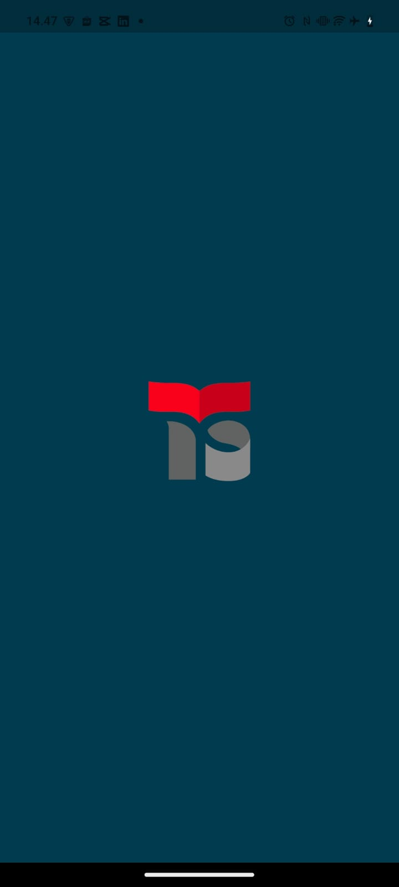
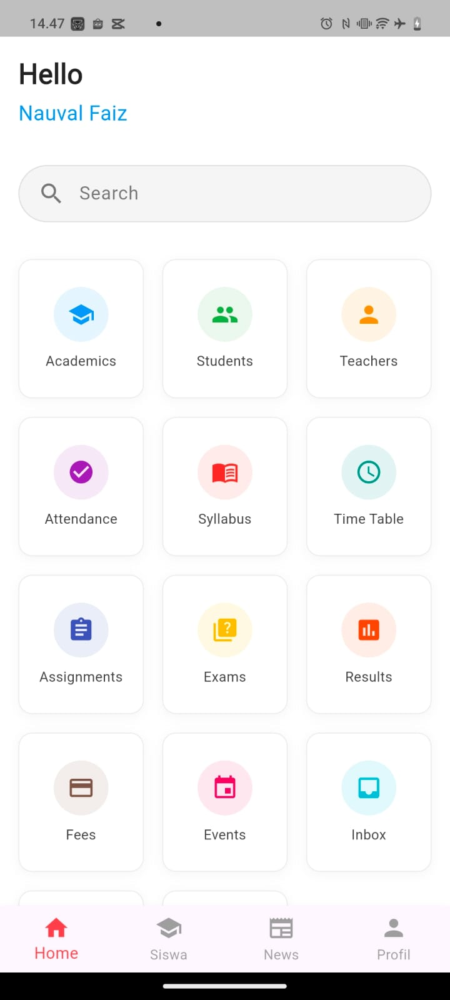
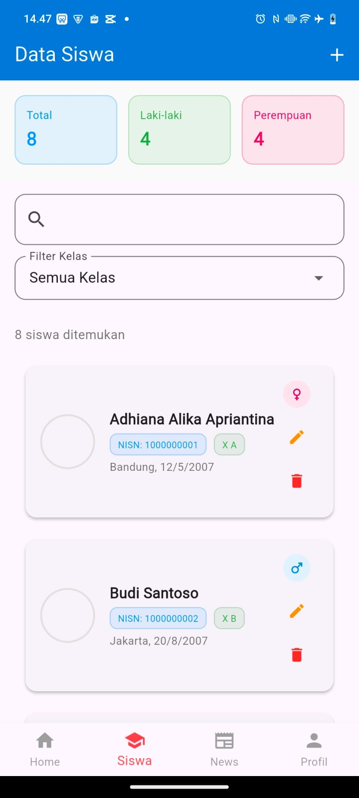
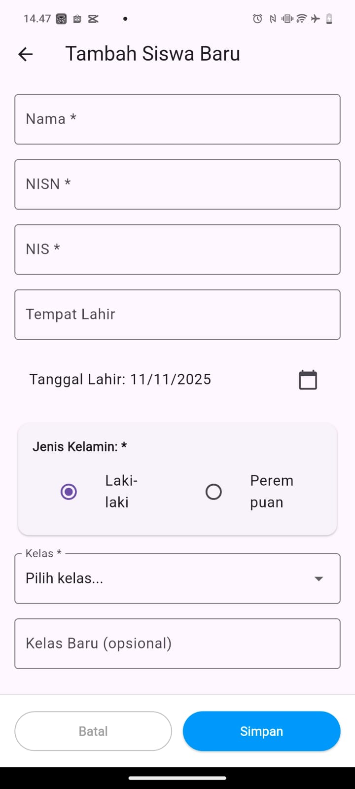
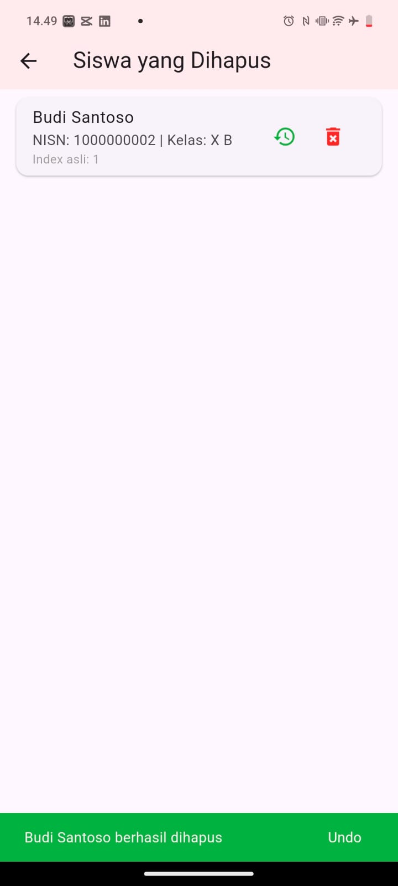
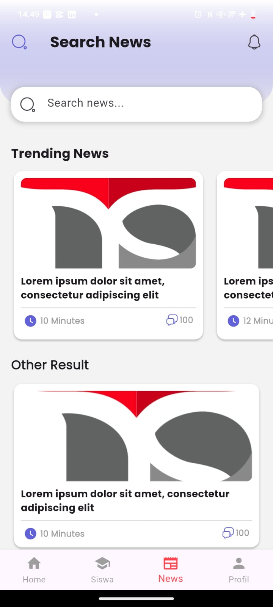
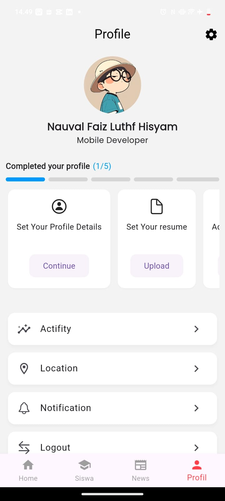

# 🎓 Aplikasi Manajemen Siswa untuk Guru — *Sekolah Cerdas*

> 🚀 Aplikasi mobile modern untuk guru mengelola data siswa, memberi update berita kelas, dan mengakses fitur-fitur canggih dari halaman utama. Desain responsif, UX intuitif, dan fitur lengkap.



---

## 🌟 Fitur Utama

✅ **Edit Data Siswa**  
Guru bisa mengubah nama, kelas, atau informasi siswa secara langsung dari dalam aplikasi.

✅ **Berita Terbaru Kelas**  
Fitur pengumuman real-time untuk siswa dan orang tua — bisa dibuat, diedit, atau dihapus oleh guru.

✅ **Dashboard Home yang Kaya Fitur**  
Halaman utama menyediakan:
- Ringkasan kehadiran
- Jadwal pelajaran
- Notifikasi penting
- Quick access ke absensi & nilai

✅ **Profil Modern & Personalisasi**  
Halaman profil guru dengan desain minimalis, dark/light mode, dan statistik aktivitas.

✅ **Responsive & Mobile First**  
Dirancang untuk iOS dan Android, dengan animasi halus dan loading indicator yang elegan.

---

## 📁 Struktur Folder Proyek
lib/
├── main.dart
├── Data/
│ ├── Array/
│ └── Models/
├── Controllers/
├── Service/
├── Views/
├── Pages/
│ ├── fitur/
│ │ └── otp.dart
│ ├── Settings/
│ ├── SQL/
│ ├── Views/
│ ├── Akun_page/
│ └── Navbar/
│ ├── widgets/
│ ├── Profil_user.dart
│ ├── root.dart
│ ├── view.dart
│ ├── HomePage.dart
│ ├── HotNews.dart
│ └── main.dart
└── Widgets/
└── Onbording/


> 🔍 **Catatan Arsitektur**  
> - Menggunakan pendekatan modular berbasis folder (`Pages`, `Controllers`, `Models`).  
> - `Pages/Navbar/` berisi halaman utama aplikasi dengan navigasi bawah.  
> - `Data/Models/` menyimpan class model (misal: `Student`, `News`, `User`).  
> - `Service/` menangani komunikasi dengan backend Laravel (via HTTP/Dio).

---

## 🖼️ Screenshots Aplikasi

| Halaman | Preview | Deskripsi |
|---------|---------|-----------|
| **Splash / Onboarding** |  | Layar awal aplikasi |
| **Home Page** |  | Dashboard utama: ringkasan kelas, akses cepat, notifikasi |
| **Data Siswa** |  | Daftar siswa dengan opsi edit & hapus |
| **Tambah Siswa** |  | Form input data siswa baru |
| **Hapus Siswa** |  | Dialog konfirmasi penghapusan |
| **Berita Kelas** |  | Buat & kelola pengumuman untuk siswa |
| **Profil Guru** |  | Halaman profil modern dengan foto, statistik, dan pengaturan |

## ⚙️ Setup & Run

1. **Clone repositori**
   ```bash
   git clone 
> 🔍 **Catatan Arsitektur**  
> - Menggunakan pendekatan modular berbasis folder (`Pages`, `Controllers`, `Models`).  
> - `Pages/Navbar/` berisi halaman utama aplikasi dengan navigasi bawah.  
> - `Data/Models/` menyimpan class model (misal: `Student`, `News`, `User`).  
> - `Service/` menangani komunikasi dengan backend Laravel (via HTTP/Dio).

---

## 🖼️ Screenshots Aplikasi

| Halaman | Preview | Deskripsi |
|---------|---------|-----------|
| **Splash / Onboarding** |  | Layar awal aplikasi |
| **Home Page** |  | Dashboard utama: ringkasan kelas, akses cepat, notifikasi |
| **Data Siswa** |  | Daftar siswa dengan opsi edit & hapus |
| **Tambah Siswa** |  | Form input data siswa baru |
| **Hapus Siswa** |  | Dialog konfirmasi penghapusan |
| **Berita Kelas** |  | Buat & kelola pengumuman untuk siswa |
| **Profil Guru** |  | Halaman profil modern dengan foto, statistik, dan pengaturan |

> ⚠️ Pastikan file gambar tersedia di folder `assets/images/` dan dideklarasikan di `pubspec.yaml`:
> ```yaml
> flutter:
>   assets:
>     - assets/images/1Place_screen.jpg
>     - assets/images/2HomePage.jpg
>     - assets/images/3data_siswa.jpg
>     - assets/images/4Tambah_siswa.jpg
>     - assets/images/5hapus_siswa.jpg
>     - assets/images/6News.jpg
>     - assets/images/7Profile.jpg
> ```

---

## ⚙️ Setup & Run

1. **Clone repositori**
   ```bash
   git clone https://github.com/nama-anda/aplikasi-siswa-guru.git
   cd aplikasi-siswa-guru
   cd aplikasi-siswa-guru